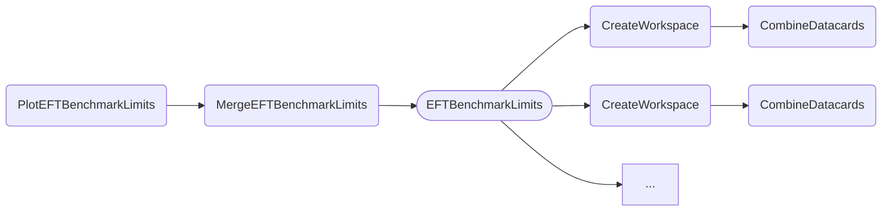
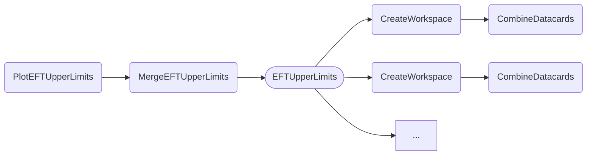

The tasks documented below produce and visualize limits of two different EFT workflows, i.e., different (discrete) [EFT benchmarks](#benchmark-limits) and a [scan of the *c2* (*ffHH*) coupling](#scan-of-c2).
Compared to the [other tasks for obtaining limits](limits.md) which rely on the HH physics model for inter- and extrapolating the effect of variations of the *kappa* values, the EFT limit tasks extract information of the benchmark name or *c2* value directly from the name of the datacard files.
This entails two major differences in the preparation of datacards and the steering of the tasks via parameters.

**Datacards**

The datacards for the various EFT benchmarks and *c2* values should be prepared according to the central [EFT documentation](https://gitlab.cern.ch/hh/eft-benchmarks).
Names of datacard files should have the following format:

- Benchmarks: `datacard_<NAME>.txt`, where `NAME` is the name of the particular benchmark.
- *c2* scan: `datacard_c2_<VALUE>.txt`, where `VALUE` is the corresponding value of *c2*. The value parsing accepts two different formats, i.e. `1.5` or `1d5` for positive, and `-1.5` or `m1d5` for negative numbers.

==If your datacards contribute to the HH combination==, please make sure to use the ==exact same== naming scheme for processes, bins and parameters as the other datacards provided by your channel.

**Task parameters**

As benchmark names and *c2* values are extracted from names of the datacard files, the usual `--datacards` parameter cannot be used as it would not support the combination of cards across multiple channels.
The tasks below use the `--multi-datacards` parameter instead, allowing multiple sequences of files, separated by `:`, to be passed in the format `ch1/cardA,ch1/cardB:ch2/cardA,ch2/cardB`
In this example, the different sequences could correspond to different analysis channels.
Files with the same (base)name across sequences will be combined by means of the `CombineDatacards` task.
Therefore, a valid example is

```shell
--multi-datacards 'my_cards/datacard_c2_*.txt'
```

for a single channel, and

```shell
--multi-datacards 'bbbb/datacard_c2_*.txt:bbgg/datacard_c2_*.txt'
```

for multiple channels, where datacards corresponding to the same *c2* value will be combined across the channels.


### Benchmark limits

The `PlotEFTBenchmarkLimits` task shows the upper limits on the rate of HH production via gluon-gluon fusion (POI `r_gghh`) obtained for several EFT benchmarks.
As described above, datacard names should have the format `datacard_<NAME>.txt`.

- [Quick example](#quick-example)
- [Dependencies](#dependencies)
- [Parameters](#parameters)
- [Example commands](#example-commands)


#### Quick example

```shell
law run PlotEFTBenchmarkLimits \
    --version dev \
    --multi-datacards $DHI_EXAMPLE_CARDS_EFT_BM \
    --xsec fb
```

As described above, the `--multi-datacards` parameter should be used to identify different sequences of datacards.

Output:


#### Dependencies



Rounded boxes mark [workflows](practices.md#workflows) with the option to run tasks as HTCondor jobs.


#### Parameters

=== "PlotEFTBenchmarkLimits"

    --8<-- "content/snippets/ploteftbenchmarklimits_param_tab.md"

=== "MergeEFTBenchmarkLimits"

    --8<-- "content/snippets/mergeeftbenchmarklimits_param_tab.md"

=== "EFTBenchmarkLimits"

    --8<-- "content/snippets/eftbenchmarklimits_param_tab.md"

=== "CreateWorkspace"

    --8<-- "content/snippets/createworkspace_param_tab.md"

=== "CombineDatacards"

    --8<-- "content/snippets/combinedatacards_param_tab.md"


#### Example commands

**1.** Execute `EFTBenchmarkLimits` tasks on HTCondor and apply the branching ratio of the `bbgg` channel to extracted limits:

```shell hl_lines="5-6"
law run PlotEFTBenchmarkLimits \
    --version dev \
    --multi-datacards $DHI_EXAMPLE_CARDS_EFT_BM \
    --xsec fb \
    --br bbgg \
    --EFTBenchmarkLimits-workflow htcondor
```


### Scan of `c2`

The `PlotEFTUpperLimits` task shows the upper limits on the rate of HH production via gluon-gluon fusion (POI `r_gghh`) obtained for several EFT coupling values.
As described above, datacard names should have the format `datacard_c2_<VALUE>.txt`.

- [Quick example](#quick-example_1)
- [Dependencies](#dependencies_1)
- [Parameters](#parameters_1)
- [Example commands](#example-commands_1)


#### Quick example

```shell
law run PlotEFTUpperLimits \
    --version dev \
    --multi-datacards $DHI_EXAMPLE_CARDS_EFT_C2 \
    --xsec fb
```

As described above, the `--multi-datacards` parameter should be used to identify different sequences of datacards.

Output:


#### Dependencies



Rounded boxes mark [workflows](practices.md#workflows) with the option to run tasks as HTCondor jobs.


#### Parameters

=== "PlotEFTUpperLimits"

    --8<-- "content/snippets/ploteftupperlimits_param_tab.md"

=== "MergeEFTUpperLimits"

    --8<-- "content/snippets/mergeeftupperlimits_param_tab.md"

=== "EFTUpperLimits"

    --8<-- "content/snippets/eftupperlimits_param_tab.md"

=== "CreateWorkspace"

    --8<-- "content/snippets/createworkspace_param_tab.md"

=== "CombineDatacards"

    --8<-- "content/snippets/combinedatacards_param_tab.md"


#### Example commands

**1.** Execute `EFTUpperLimits` tasks on HTCondor, apply the branching ratio of the `bbgg` channel to extracted limits, and limit the scan range to values between -1 and 1 (inclusive):

```shell hl_lines="5-7"
law run PlotEFTUpperLimits \
    --version dev \
    --multi-datacards $DHI_EXAMPLE_CARDS_EFT_BM \
    --xsec fb \
    --br bbgg \
    --scan-range=-1,1 \
    --EFTUpperLimits-workflow htcondor
```
