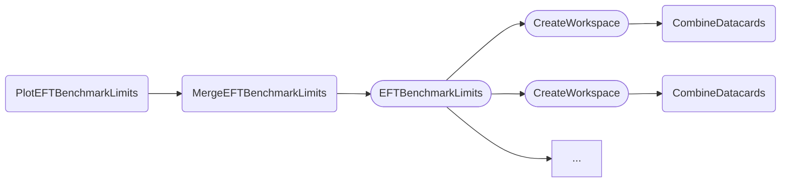

The tasks documented below can be used to produce and visualize the limits corresponding to certain discrete EFT benchmark.
Compared to the [other tasks for obtaining limits](limits.md) which rely on the HH physics model for inter- and extrapolating the effect of variations of the *kappa* values, the EFT benchmark tasks extract information of the particular benchmarks directly ==from the name of the used datacard files==.
This entails two major differences in the preparation of datacards and the steering of the tasks via parameters.

**Datacards**

The datacards for the various EFT benchmarks should be prepared according to the central [naming and datacard conventions](https://gitlab.cern.ch/hh/naming-conventions#hh-signals-for-eft-results) as well as the [EFT documentation](https://gitlab.cern.ch/hh/eft-benchmarks).
In particular, please make sure that

- your ggF signal is normalized to a hypothetical cross section of 1 **pb** (❗️) times the **branching ratio of your channel**, and
- that VBF processes (`qqHH_*`) are dropped except for the SM VBF signal, which should be marked as background by attributing a positive process id to it.

Names of EFT benchmark datacard files should have the format

```
datacard_<some_other_info>_<NAME>.txt
```

where `NAME` is the name of the particular benchmark.

For automatic benchmark grouping (e.g. into JHEP03 or JHEP04) within plots, you should use `NAME`'s such as `JHEP04BM1`, `JHEP04BM2`, etc, which are special names recognized by the plot routines. See `bm_labels` in [dhi/config.py](https://gitlab.cern.ch/hh/tools/inference/-/blob/master/dhi/config.py) for a list of all known `NAME`'s.


==If your datacards contribute to the HH combination==, please make sure to use the ==exact same== naming scheme for processes, bins and parameters as the other datacards provided by your channel.

**Task parameters**

==Unlike==, for instance, the [upper limit](limits.md#limit-on-poi-vs-scan-parameter) or [likelihood scan](likelihood.md#single-likelihood-profiles) tasks where a single set of combined cards is used to extract results over a range of scan parameter values, each benchmark point requires its own datacard.

Therefore, the cards passed to `--datacards` are actually parsed using the regular expression configured by the `--datacard-pattern` parameter, which defaults to `^.*_([^_]+)\.txt$` (meaning `<any_text>_<benchmark_name_without_underscores>.txt`).
The benchmark name is extracted using this expression (matching everything that within the brackets, i.e., the last string without underscores before the `.txt`) and datacards with the same benchmark name are combined.
For instance, when passing

```
--datacards ch1/datacard_JHEP04BM1.txt,ch1/datacard_JHEP04BM2.txt,ch2/datacard_JHEP04BM1.txt
```

the eft benchmark limit tasks will combine the first and last datacards as they are both corresponding to benchmark `JHEP04BM1`, and then compute two limits for `JHEP04BM1` and `JHEP04BM2`.

As usual, showing limit scans for multiple sequences (see [below](#multiple-benchmark-limits)) requires the `--multi-datacards` parameter to be set instead.
Multiple comma-separeted sequences are themselves separated by a color character, so

```
--multi-datacards ch1/datacard_JHEP04BM1.txt,ch1/datacard_JHEP04BM2.txt:ch2/datacard_JHEP04BM1.txt
```

will perform two separate scans, one at benchmarks `JHEP04BM1` and `JHEP04BM2` for cards in `ch1/`, and one scan at a benchmark `JHEP04BM1` for the card in `ch2/`.


### Benchmark limits

The `PlotEFTBenchmarkLimits` task shows the upper limits on the rate of HH production via gluon-gluon fusion (POI `r_gghh`) obtained for several EFT benchmarks.

- [Quick example](#quick-example)
- [Dependencies](#dependencies)
- [Parameters](#parameters)
- [Example commands](#example-commands)


#### Quick example

```shell
law run PlotEFTBenchmarkLimits \
    --version dev \
    --datacards $DHI_EXAMPLE_CARDS_EFT_BM \
    --xsec fb
```

Output:


#### Dependencies



Rounded boxes mark [workflows](practices.md#workflows) with the option to run tasks as HTCondor jobs.


#### Parameters

=== "PlotEFTBenchmarkLimits"

    --8<-- "content/snippets/ploteftbenchmarklimits_param_tab.md"

=== "MergeEFTBenchmarkLimits"

    --8<-- "content/snippets/mergeeftbenchmarklimits_param_tab.md"

=== "EFTBenchmarkLimits"

    --8<-- "content/snippets/eftbenchmarklimits_param_tab.md"

=== "CreateWorkspace"

    --8<-- "content/snippets/createworkspace_param_tab.md"

=== "CombineDatacards"

    --8<-- "content/snippets/combinedatacards_param_tab.md"


#### Example commands

**1.** Execute `EFTBenchmarkLimits` tasks on HTCondor and apply the branching ratio of the `bbgg` channel to extracted limits:

```shell hl_lines="5-6"
law run PlotEFTBenchmarkLimits \
    --version dev \
    --datacards $DHI_EXAMPLE_CARDS_EFT_BM \
    --xsec fb \
    --br bbgg \
    --EFTBenchmarkLimits-workflow htcondor
```


### Multiple benchmark limits

The `PlotMultipleEFTBenchmarkLimits` task shows the upper limits on the rate of HH production via gluon-gluon fusion (POI `r_gghh`) obtained for several EFT benchmarks, but unlike `PlotEFTBenchmarkLimits` described [above](#benchmark-limits), results of datacards are not combined per benchmark, but separately shown.

- [Quick example](#quick-example_1)
- [Dependencies](#dependencies_1)
- [Parameters](#parameters_1)
- [Example commands](#example-commands_1)


#### Quick example

```shell
law run PlotMultipleEFTBenchmarkLimits \
    --version dev \
    --multi-datacards $DHI_EXAMPLE_CARDS_EFT_BM_1:$DHI_EXAMPLE_CARDS_EFT_BM_2 \
    --xsec fb
```

As described above, the `--multi-datacards` parameter should be used to identify different sequences of datacards.

Output:


#### Dependencies


Rounded boxes mark [workflows](practices.md#workflows) with the option to run tasks as HTCondor jobs.


#### Parameters

=== "PlotMultipleEFTBenchmarkLimits"

    --8<-- "content/snippets/plotmultipleeftbenchmarklimits_param_tab.md"

=== "MergeEFTBenchmarkLimits"

    --8<-- "content/snippets/mergeeftbenchmarklimits_param_tab.md"

=== "EFTBenchmarkLimits"

    --8<-- "content/snippets/eftbenchmarklimits_param_tab.md"

=== "CreateWorkspace"

    --8<-- "content/snippets/createworkspace_param_tab.md"

=== "CombineDatacards"

    --8<-- "content/snippets/combinedatacards_param_tab.md"


#### Example commands

**1.** Execute `EFTBenchmarkLimits` tasks on HTCondor:

```shell hl_lines="5"
law run PlotMultipleEFTBenchmarkLimits \
    --version dev \
    --multi-datacards $DHI_EXAMPLE_CARDS_EFT_BM_1:$DHI_EXAMPLE_CARDS_EFT_BM_2 \
    --xsec fb \
    --EFTBenchmarkLimits-workflow htcondor
```
