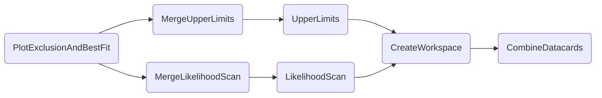
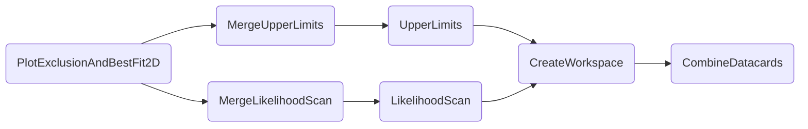

The exclusion plots combine results from scans of [upper limits](./limits.md) and [likelihood profiles](./likelihood.md).


### Comparison of exclusion performance

This chain of tasks leads to a plot that shows the excluded regions of a scanned parameter and its best fit value for multiple *configurations*.
These can be different versions of datacards, or even channels or analyses as shown in the following.

- [Quick example](#quick-example)
- [Dependencies](#dependencies)
- [Parameters](#parameters)
- [Example commands](#example-commands)


#### Quick example

```shell
law run PlotExclusionAndBestFit \
    --version dev \
    --multi-datacards /afs/cern.ch/user/m/mfackeld/public/datacards/ee_tight/datacard.txt:/afs/cern.ch/user/m/mfackeld/public/datacards/emu_tight/datacard.txt:/afs/cern.ch/user/m/mfackeld/public/datacards/mumu_tight/datacard.txt:/afs/cern.ch/user/m/mfackeld/public/datacards/*/datacard.txt \
    --datacard-names ee,emu,mumu,Combined \
    --pois r_gghh \
    --campaign FAKE
```

Note that `kl,-25,25` is the default scan parameter.

Output:


#### Dependencies




#### Parameters

=== "PlotExclusionAndBestFit"

    --8<-- "content/snippets/plotexclusionandbestfit_param_tab.md"

=== "MergeUpperLimits"

    --8<-- "content/snippets/mergeupperlimits_param_tab.md"

=== "UpperLimits"

    --8<-- "content/snippets/upperlimits_param_tab.md"

=== "MergeLikelihoodScan"

    --8<-- "content/snippets/mergelikelihoodscan_param_tab.md"

=== "LikelihoodScan"

    --8<-- "content/snippets/likelihoodscan_param_tab.md"

=== "CreateWorkspace"

    --8<-- "content/snippets/createworkspace_param_tab.md"

=== "CombineDatacards"

    --8<-- "content/snippets/combinedatacards_param_tab.md"


#### Example commands

**1.** Executing `PlotExclusionAndBestFit` of `C2V` from `-5..5` with 4 local cores.

```shell hl_lines="6-9"
law run PlotExclusionAndBestFit \
    --version dev \
    --multi-datacards /afs/cern.ch/user/m/mfackeld/public/datacards/ee_tight/datacard.txt:/afs/cern.ch/user/m/mfackeld/public/datacards/emu_tight/datacard.txt:/afs/cern.ch/user/m/mfackeld/public/datacards/mumu_tight/datacard.txt:/afs/cern.ch/user/m/mfackeld/public/datacards/*/datacard.txt \
    --datacard-names ee,emu,mumu,Combined \
    --pois r \
    --scan-parameters C2V,-5,5 \
    --LikelihoodScan-workflow local \
    --UpperLimits-workflow local \
    --workers 4 \
    --campaign FAKE
```


**2.** Executing `PlotExclusionAndBestFit` tasks on htcondor, managed by 4 local workers.

```shell hl_lines="7-9"
law run PlotExclusionAndBestFit \
    --version dev \
    --multi-datacards /afs/cern.ch/user/m/mfackeld/public/datacards/ee_tight/datacard.txt:/afs/cern.ch/user/m/mfackeld/public/datacards/emu_tight/datacard.txt:/afs/cern.ch/user/m/mfackeld/public/datacards/mumu_tight/datacard.txt:/afs/cern.ch/user/m/mfackeld/public/datacards/*/datacard.txt \
    --datacard-names ee,emu,mumu,Combined \
    --pois r \
    --scan-parameters C2V,-5,5 \
    --LikelihoodScan-workflow htcondor \
    --UpperLimits-workflow htcondor \
    --workers 4 \
    --campaign FAKE
```


### 2D parameter exclusion

The `PlotExclusionAndBestFit2D` gathers data from [upper limit](./limits.md) and [likelihood profiling](./likelihood.md) tasks to create a plot showing the excluded region of two scan parameters as well as the position and errors of their best fit values.

- [Quick example](#quick-example_1)
- [Dependencies](#dependencies_1)
- [Parameters](#parameters_1)
- [Example commands](#example-commands_1)


#### Quick example

```shell
law run PlotExclusionAndBestFit2D \
    --version dev \
    --datacards $DHI_EXAMPLE_CARDS \
    --pois r \
    --scan-parameters kl,-30,30,61:kt,-6,9,31
```

Output:


#### Dependencies




#### Parameters

=== "PlotExclusionAndBestFit2D"

    --8<-- "content/snippets/plotexclusionandbestfit2d_param_tab.md"

=== "MergeUpperLimits"

    --8<-- "content/snippets/mergeupperlimits_param_tab.md"

=== "UpperLimits"

    --8<-- "content/snippets/upperlimits_param_tab.md"

=== "MergeLikelihoodScan"

    --8<-- "content/snippets/mergelikelihoodscan_param_tab.md"

=== "LikelihoodScan"

    --8<-- "content/snippets/likelihoodscan_param_tab.md"

=== "CreateWorkspace"

    --8<-- "content/snippets/createworkspace_param_tab.md"

=== "CombineDatacards"

    --8<-- "content/snippets/combinedatacards_param_tab.md"


#### Example commands

**1.** Executing `PlotExclusionAndBestFit2D` of `kl` and `C2V` on htcondor with each job processing 3 tasks, managed by 2 local processes.

```shell hl_lines="5-10"
law run PlotExclusionAndBestFit \
    --version dev \
    ---datacards $DHI_EXAMPLE_CARDS \
    --pois r \
    --scan-parameters C2V,-5,5:CV,-5,5 \
    --LikelihoodScan-workflow htcondor \
    --LikelihoodScan-tasks-per-job 3 \
    --UpperLimits-workflow htcondor \
    --UpperLimits-tasks-per-job 3 \
    --workers 2 \
    --campaign FAKE
```
