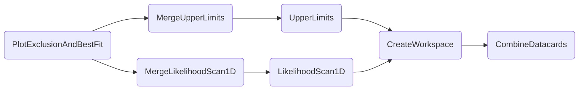

### Combined plot: fit and exclusion

The task `PlotBestFitAndExclusion` creates a plot showing the best fit values of a POI as well as its excluded region for multiple *configurations* - these can be different versions of datacards, or even channels or analyses as shown in the following plot.


```shell
law run PlotExclusionAndBestFit \
    --version dev \
    --multi-datacards /afs/cern.ch/user/m/mfackeld/public/datacards/ee_tight/datacard.txt:/afs/cern.ch/user/m/mfackeld/public/datacards/emu_tight/datacard.txt:/afs/cern.ch/user/m/mfackeld/public/datacards/mumu_tight/datacard.txt:/afs/cern.ch/user/m/mfackeld/public/datacards/*/datacard.txt \
    --datacard-names ee,emu,mumu,Combined \
    --pois r_gghh \
    --campaign FAKE
```

Output:


The best fit values are extracted via likelihood profiling done by the [`LikelihoodScan1D`](likelihood1d.md) task. Excluded regions are inferred from the [`UpperLimits`](limits.md) task which scans limits in steps of the same POI as measured on a `--pois`, i.e., `r` itself, `r_gghh`or `r_qqhh`.


#### Dependencies




#### Parameters

=== "PlotExclusionAndBestFit"

    --8<-- "content/snippets/plotexclusionandbestfit_param_tab.md"

=== "MergeUpperLimits"

    --8<-- "content/snippets/mergeupperlimits_param_tab.md"

=== "UpperLimits"

    --8<-- "content/snippets/upperlimits_param_tab.md"

=== "MergeLikelihoodScan"

    --8<-- "content/snippets/mergelikelihoodscan_param_tab.md"

=== "LikelihoodScan"

    --8<-- "content/snippets/likelihoodscan_param_tab.md"

=== "CreateWorkspace"

    --8<-- "content/snippets/createworkspace_param_tab.md"

=== "CombineDatacards"

    --8<-- "content/snippets/combinedatacards_param_tab.md"


#### Example commands

1. PlotExclusionAndBestFit of `C2V` from `-5..5` with 4 local cores:

```shell hl_lines="7-10"
law run PlotExclusionAndBestFit \
    --version dev \
    --multi-datacards /afs/cern.ch/user/m/mfackeld/public/datacards/ee_tight/datacard.txt:/afs/cern.ch/user/m/mfackeld/public/datacards/emu_tight/datacard.txt:/afs/cern.ch/user/m/mfackeld/public/datacards/mumu_tight/datacard.txt:/afs/cern.ch/user/m/mfackeld/public/datacards/*/datacard.txt \
    --datacard-names ee,emu,mumu,Combined \
    --pois r_gghh \
    --campaign FAKE \
    --scan-parameters "C2V,-5,5" \
    --LikelihoodScan-workflow local \
    --UpperLimits-workflow local \
    --workers 4
```

2. Executing `PlotExclusionAndBestFit` tasks on htcondor, managed by 4 local workers:

```shell hl_lines="7-9"
law run PlotExclusionAndBestFit \
    --version dev \
    --multi-datacards /afs/cern.ch/user/m/mfackeld/public/datacards/ee_tight/datacard.txt:/afs/cern.ch/user/m/mfackeld/public/datacards/emu_tight/datacard.txt:/afs/cern.ch/user/m/mfackeld/public/datacards/mumu_tight/datacard.txt:/afs/cern.ch/user/m/mfackeld/public/datacards/*/datacard.txt \
    --datacard-names ee,emu,mumu,Combined \
    --pois r_gghh \
    --campaign FAKE \
    --LikelihoodScan-workflow htcondor \
    --UpperLimits-workflow htcondor \
    --workers 4
```