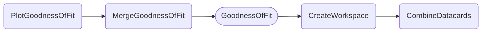

### Testing a datacard

The `PlotGoodnessOfFit` task shows the test statistic value of a goodness-of-fit test between data and simulation as well as for a configurable number of toys.
The fit model is extracted from a single set of datacards.
A gaussian fit is performed to model the toy distribution and to infer a distance to the data test statistic in units of standard deviations.

- [Quick example](#quick-example)
- [Dependencies](#dependencies)
- [Parameters](#parameters)
- [Example commands](#example-commands)


#### Quick example

```shell
law run PlotGoodnessOfFit \
    --version dev \
    --datacards $DHI_EXAMPLE_CARDS \
    --toys 1000 \
    --toys-per-task 20
```

Output:


#### Dependencies



Rounded boxes mark [workflows](practices.md#workflows) with the option to run tasks as HTCondor jobs.


#### Parameters

=== "PlotGoodnessOfFit"

    --8<-- "content/snippets/plotgoodnessoffit_param_tab.md"

=== "MergeGoodnessOfFit"

    --8<-- "content/snippets/mergegoodnessoffit_param_tab.md"

=== "GoodnessOfFit"

    --8<-- "content/snippets/goodnessoffit_param_tab.md"

=== "CreateWorkspace"

    --8<-- "content/snippets/createworkspace_param_tab.md"

=== "CombineDatacards"

    --8<-- "content/snippets/combinedatacards_param_tab.md"


#### Example commands

**1.** Run the test with the `KS` algorithm, executing tasks on htcondor.

```shell hl_lines="6-7"
law run PlotGoodnessOfFit \
    --version dev \
    --datacards $DHI_EXAMPLE_CARDS
    --toys 1000 \
    --toys-per-task 20 \
    --algorithm KS \
    --GoodnessOfFit-workflow htcondor
```
