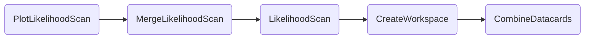

### 1D/2D Likelihood scans

1D:
```shell
law run PlotLikelihoodScan --version dev \
    --datacards $DHI_EXAMPLE_CARDS \
    --pois "kl" \
    --scan-parameters "kl,-25,25"
```

Output:

 


2D:
```shell
law run PlotLikelihoodScan --version dev \
    --datacards $DHI_EXAMPLE_CARDS \
    --pois "kl,kt" \
    --scan-parameters "kl,-30,30:kt,-10,10"
```

Output:


#### Dependencies




#### Parameters


=== "PlotLikelihoodScan"

    --8<-- "content/snippets/plotlikelihoodscan_param_tab.md"

=== "MergeLikelihoodScan"

    --8<-- "content/snippets/mergelikelihoodscan_param_tab.md"

=== "LikelihoodScan"

    --8<-- "content/snippets/likelihoodscan_param_tab.md"

=== "CreateWorkspace"

    --8<-- "content/snippets/createworkspace_param_tab.md"

=== "CombineDatacards"

    --8<-- "content/snippets/combinedatacards_param_tab.md"


#### Example commands

1. Likelihoodscan of `C2V` from `-5..5` with 4 local cores:

```shell hl_lines="4-7"
law run PlotLikelihoodScan \
    --version dev \
    --datacards $DHI_EXAMPLE_CARDS \
    --LikelihoodScan-workflow local \
    --workers 4 \
    --pois "C2V" \
    --scan-parameters "C2V,-5,5"
```

2. Executing `LikelihoodScan` tasks on htcondor, with one job handling three tasks sequentially:

```shell hl_lines="5-6"
law run PlotLikelihoodScan --version dev \
    --datacards $DHI_EXAMPLE_CARDS \
    --pois "kl,kt" \
    --scan-parameters "kl,-30,30:kt,-10,10" \
    --LikelihoodScan-workflow htcondor \
    --LikelihoodScan-tasks-per-job 3
```