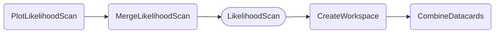
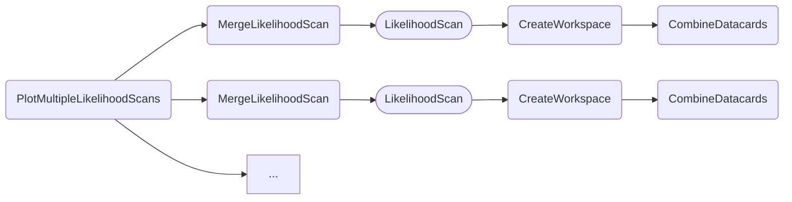
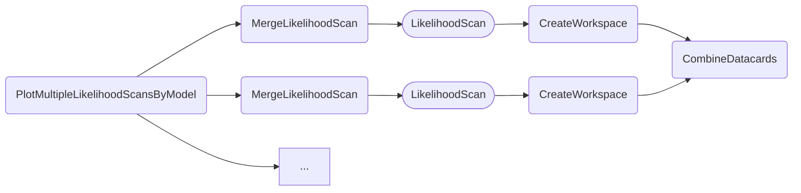

### Single likelihood profiles

The likelihood scan and plotting tasks perform fits where the profiled POI(s) are identical to the parameter(s) being scanned, such as `kl`, `C2V` (1D) or `kl,C2V` (2D).

- [Quick examples](#quick-examples)
    - [1D](#1d)
    - [2D](#2d)
- [Dependencies](#dependencies)
- [Parameters](#parameters)
- [Example commands](#example-commands)


#### Quick examples

##### 1D

```shell
law run PlotLikelihoodScan \
    --version dev \
    --datacards $DHI_EXAMPLE_CARDS \
    --pois kl \
    --scan-parameters kl,-25,25
```

Note that `kl` is used in both `--pois` and `--scan-parameters` and must be identical.

Output:


##### 2D

```shell
law run PlotLikelihoodScan
    --version dev \
    --datacards $DHI_EXAMPLE_CARDS \
    --pois kl,kt \
    --scan-parameters kl,-30,30:kt,-10,10
```

Note that `kl` and `kt` are used in both `--pois` and `--scan-parameters` and must be identical.
When two POIs are given, the plot task automatically triggers the creation of the 2D plot.

Output:


#### Dependencies



Rounded boxes mark [workflows](practices.md#workflows) with the option to run tasks as HTCondor jobs.


#### Parameters

=== "PlotLikelihoodScan"

    --8<-- "content/snippets/plotlikelihoodscan_param_tab.md"

=== "MergeLikelihoodScan"

    --8<-- "content/snippets/mergelikelihoodscan_param_tab.md"

=== "LikelihoodScan"

    --8<-- "content/snippets/likelihoodscan_param_tab.md"

=== "CreateWorkspace"

    --8<-- "content/snippets/createworkspace_param_tab.md"

=== "CombineDatacards"

    --8<-- "content/snippets/combinedatacards_param_tab.md"


#### Example commands

**1.** Likelihoodscan of `C2V` from `-5..5` with 4 local cores.

```shell hl_lines="4-7"
law run PlotLikelihoodScan \
    --version dev \
    --datacards $DHI_EXAMPLE_CARDS \
    --LikelihoodScan-workflow local \
    --workers 4 \
    --pois C2V \
    --scan-parameters C2V,-5,5
```


**2.** Executing `LikelihoodScan` tasks on htcondor, with one job handling three tasks sequentially.

```shell hl_lines="5-6"
law run PlotLikelihoodScan \
    --version dev \
    --datacards $DHI_EXAMPLE_CARDS \
    --pois kl,kt \
    --scan-parameters kl,-30,30:kt,-10,10 \
    --LikelihoodScan-workflow htcondor \
    --LikelihoodScan-tasks-per-job 3
```


### Likelihood profiles for multiple sets of datacards

In addition to the plots described above a variation exists to provide a visual comparison between multiple *configurations* - these can be different versions of datacards, or even channels or analyses.
The task is called `PlotMultipleLikelihoodScans` and is able to produce plots for 1D and 2D comparisons.
As above, the underlying likelihood scan task performs fits where the profiled POI(s) are identical to the parameter(s) being scanned, such as `kl`, `C2V` (1D) or `kl,C2V` (2D).

- [Quick examples](#quick-examples_1)
    - [1D](#1d_1)
    - [2D](#2d_1)
- [Dependencies](#dependencies_1)
- [Parameters](#parameters_1)
- [Example commands](#example-commands_1)


#### Quick examples

##### 1D

```shell
law run PlotMultipleLikelihoodScans \
    --version dev \
    --multi-datacards $DHI_EXAMPLE_CARDS:$DHI_EXAMPLE_CARDS_GGF:$DHI_EXAMPLE_CARDS_VBF \
    --pois kl \
    --scan-parameters kl,-10,10,21
```

Note that `kl` is used in both `--pois` and `--scan-parameters` and must be identical.

Output:


##### 2D

```shell
law run PlotMultipleLikelihoodScans \
    --version dev \
    --multi-datacards $DHI_EXAMPLE_CARDS:$DHI_EXAMPLE_CARDS_GGF:$DHI_EXAMPLE_CARDS_VBF \
    --pois kl,kt \
    --scan-parameters kl,-10,10,21:kt,-5,5,11
```

Note that `kl` and `kt` are used in both `--pois` and `--scan-parameters` and must be identical.
When two POIs are given, the plot task automatically triggers the creation of the 2D plot.
Since showing more than one full likelihood profile is inadequate, the task only plots the 1 and 2 sigma contours.

Output:


#### Dependencies



Rounded boxes mark [workflows](practices.md#workflows) with the option to run tasks as HTCondor jobs.


#### Parameters

=== "PlotMultipleLikelihoodScans"

    --8<-- "content/snippets/plotmultiplelikelihoodscans_param_tab.md"

=== "MergeLikelihoodScan"

    --8<-- "content/snippets/mergelikelihoodscan_param_tab.md"

=== "LikelihoodScan"

    --8<-- "content/snippets/likelihoodscan_param_tab.md"

=== "CreateWorkspace"

    --8<-- "content/snippets/createworkspace_param_tab.md"

=== "CombineDatacards"

    --8<-- "content/snippets/combinedatacards_param_tab.md"


#### Example commands

**1.** Multiple 1D scans with renamed labels, processed with 4 local cores.

```shell hl_lines="6-7"
law run PlotMultipleLikelihoodScans \
    --version dev \
    --multi-datacards $DHI_EXAMPLE_CARDS:$DHI_EXAMPLE_CARDS_GGF:$DHI_EXAMPLE_CARDS_VBF \
    --pois kl \
    --scan-parameters kl,-10,10,21 \
    --datacard-names All,ggF,VBF \
    --workers 4
```

**2.** Executing `LikelihoodScan` tasks on htcondor for 2D scans, with one job handling three tasks sequentially.

```shell hl_lines="6-7"
law run PlotMultipleLikelihoodScans \
    --version dev \
    --multi-datacards $DHI_EXAMPLE_CARDS:$DHI_EXAMPLE_CARDS_GGF:$DHI_EXAMPLE_CARDS_VBF \
    --pois kl,kt \
    --scan-parameters kl,-10,10,21:kt,-5,5,11 \
    --LikelihoodScan-workflow htcondor \
    --LikelihoodScan-tasks-per-job 3
```


### Likelihood profiles for different physics models

Alongside `PlotMultipleLikelihoodScans`, which plots multiple likelihood profiles for different sets of datacards, another task exists, `PlotMultipleLikelihoodScansByModel`, that plots profiles for different versions of the physics model.
As above, the underlying likelihood scan task performs fits where the profiled POI(s) are identical to the parameter(s) being scanned, such as `kl`, `C2V` (1D) or `kl,C2V` (2D).

- [Quick examples](#quick-examples_2)
    - [1D](#1d_2)
    - [2D](#2d_2)
- [Dependencies](#dependencies_2)
- [Parameters](#parameters_2)
- [Example commands](#example-commands_2)


#### Quick examples

##### 1D

```shell
law run PlotMultipleLikelihoodScansByModel \
    --version dev \
    --datacards $DHI_EXAMPLE_CARDS_GGF \
    --hh-models HHModelPinv.model_default,HHModelPinv.model_default@noHscaling \
    --pois kl \
    --scan-parameters kl,-20,20,21
```

Note that `kl` is used in both `--pois` and `--scan-parameters` and must be identical.

Output:


##### 2D

```shell
law run PlotMultipleLikelihoodScansByModel \
    --version dev \
    --datacards $DHI_EXAMPLE_CARDS \
    --hh-models HHModelPinv.model_default,HHModelPinv.model_default@noHscaling \
    --pois kl,kt \
    --scan-parameters kl,-10,10,21:kt,-5,5,11
```

Note that `kl` and `kt` are used in both `--pois` and `--scan-parameters` and must be identical.
When two POIs are given, the plot task automatically triggers the creation of the 2D plot.
Since showing more than one full likelihood profile is inadequate, the task only plots the 1 and 2 sigma contours.

Output:


#### Dependencies



Rounded boxes mark [workflows](practices.md#workflows) with the option to run tasks as HTCondor jobs.


#### Parameters

=== "PlotMultipleLikelihoodScansByModel"

    --8<-- "content/snippets/plotmultiplelikelihoodscansbymodel_param_tab.md"

=== "MergeLikelihoodScan"

    --8<-- "content/snippets/mergelikelihoodscan_param_tab.md"

=== "LikelihoodScan"

    --8<-- "content/snippets/likelihoodscan_param_tab.md"

=== "CreateWorkspace"

    --8<-- "content/snippets/createworkspace_param_tab.md"

=== "CombineDatacards"

    --8<-- "content/snippets/combinedatacards_param_tab.md"


#### Example commands

**1.** Multiple 1D scans with renamed labels, processed with 4 local cores.

```shell hl_lines="7-8"
law run PlotMultipleLikelihoodScansByModel \
    --version dev \
    --datacards $DHI_EXAMPLE_CARDS_GGF \
    --hh-models HHModelPinv.model_default,HHModelPinv.model_default@noHscaling \
    --pois kl \
    --scan-parameters kl,-10,10,21 \
    --hh-model-names default,noHscaling \
    --workers 4
```

**2.** Executing `LikelihoodScan` tasks on htcondor for 2D scans, with one job handling three tasks sequentially.

```shell hl_lines="7-8"
law run PlotMultipleLikelihoodScansByModel \
    --version dev \
    --datacards $DHI_EXAMPLE_CARDS_GGF \
    --hh-models HHModelPinv.model_default,HHModelPinv.model_default@noHscaling \
    --pois kl,kt \
    --scan-parameters kl,-10,10,21:kt,-5,5,11 \
    --LikelihoodScan-workflow htcondor \
    --LikelihoodScan-tasks-per-job 3
```
