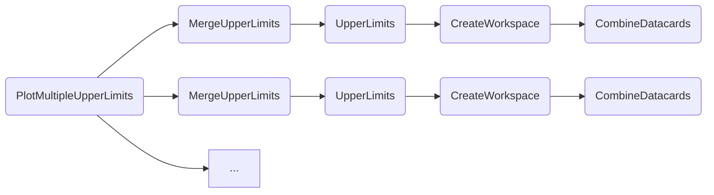
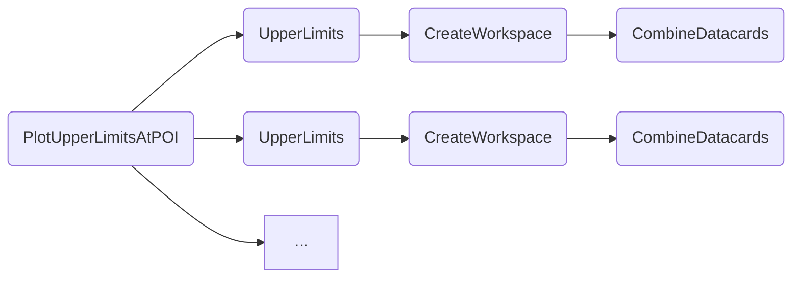

### Limit on POI vs. scan parameter

The `PlotUpperLimits` task shows the upper limits on a POI computed over a range of values of a scan parameter.

- [Quick example](#quick-example)
- [Dependencies](#dependencies)
- [Parameters](#parameters)
- [Example commands](#example-commands)


#### Quick example

```shell
law run PlotUpperLimits \
    --version dev \
    --datacards $DHI_EXAMPLE_CARDS \
    --xsec fb \
    --y-log
```

Note that the above command uses `r` as the default POI and `kl,-25,25` as the default scan parameter and range.
See the task parameters below for fore info.

Output:


#### Dependencies


#### Parameters

=== "PlotUpperLimits"

    --8<-- "content/snippets/plotupperlimits_param_tab.md"

=== "MergeUpperLimits"

    --8<-- "content/snippets/mergeupperlimits_param_tab.md"

=== "UpperLimits"

    --8<-- "content/snippets/upperlimits_param_tab.md"

=== "CreateWorkspace"

    --8<-- "content/snippets/createworkspace_param_tab.md"

=== "CombineDatacards"

    --8<-- "content/snippets/combinedatacards_param_tab.md"


#### Example commands

1. Limit on `r_qqhh` vs. `C2V` with 4 local cores:

```shell hl_lines="4-6"
law run PlotUpperLimits \
    --version dev \
    --datacards $DHI_EXAMPLE_CARDS \
    --pois r_qqhh \
    --scan-parameters C2V,-10,10,21 \
    --workers 4
```

2. Executing `UpperLimit` tasks on htcondor, with one job handling two tasks sequentially:

```shell hl_lines="4-5"
law run PlotUpperLimits \
    --version dev \
    --datacards $DHI_EXAMPLE_CARDS \
    --UpperLimits-workflow htcondor \
    --tasks-per-job 2
```


### Multiple limits on POI vs. scan parameter

There are two plots that provide a visual comparison between multiple *configurations* - these can be different versions of datacards, or even channels or analyses.

The first one, `PlotMultipleUpperLimits`, draws multiple limits just as done with `PlotUpperLimits`.
The only difference is that only the median limit is shown to provide a better visual aid.

Instead of a parameter `--datacards`, this task introduces a `--multi-datacards` parameter.
It takes several CSV sequences of datacard paths, separated by a colon, e.g. `--multi-datacards card_ee_1.txt,card_ee_2.txt:card_mumu_1.txt,card_mumu_2.txt`.
In this example, the two `card_ee_*.txt` and the two `card_mumu_*.txt` cards will result in two dedicated measurmments, following the same task requirements, i.e., `UpperLimits` and `MergeUpperLimits`, as described above.

- [Quick example](#quick-example_1)
- [Dependencies](#dependencies_1)
- [Parameters](#parameters_1)
- [Example commands](#example-commands_1)


#### Quick example

```shell
law run PlotMultipleUpperLimits \
    --version dev \
    --multi-datacards /afs/cern.ch/user/m/mfackeld/public/datacards/ee_tight/datacard.txt:/afs/cern.ch/user/m/mfackeld/public/datacards/emu_tight/datacard.txt:/afs/cern.ch/user/m/mfackeld/public/datacards/mumu_tight/datacard.txt \
    --datacard-names ee,emu,mumu \
    --xsec fb \
    --y-log
```

Note that the above command uses `r` as the default POI and `kl,-25,25` as the default scan parameter and range.
See the task parameters below for fore info.

Output:


#### Dependencies




#### Parameters

Parameters of the upstream dependencies `MergeUpperLimits` to `CombineDatacards` are explained [above](#parameters).

=== "PlotMultipleUpperLimits"

    --8<-- "content/snippets/plotmultipleupperlimits_param_tab.md"


#### Example commands

1. Executing `UpperLimit` tasks on htcondor, with one job handling two tasks sequentially:

```shell hl_lines="4-5"
law run PlotUpperLimits \
    --multi-datacards /afs/cern.ch/user/m/mfackeld/public/datacards/ee_tight/datacard.txt:/afs/cern.ch/user/m/mfackeld/public/datacards/emu_tight/datacard.txt:/afs/cern.ch/user/m/mfackeld/public/datacards/mumu_tight/datacard.txt \
    --datacard-names ee,emu,mumu \
    --UpperLimits-workflow htcondor \
    --tasks-per-job 2
```


### Multiple limits at a certain POI value

The second task, `PlotUpperLimitsAtPOI`, creates a plot comparing upper limits at a certain POI value.
Just as for the `PlotMultipleUpperLimits` task above, it includes a parameter `--multi-datacards` that accepts multiple CSV sequences of datacard paths, separated with a colon to denote multiple measurements.

- [Quick example](#quick-example_2)
- [Dependencies](#dependencies_2)
- [Parameters](#parameters_2)
- [Example commands](#example-commands_2)


#### Quick example

```shell
law run PlotUpperLimitsAtPOI \
    --version dev \
    --multi-datacards /afs/cern.ch/user/m/mfackeld/public/datacards/ee_tight/datacard.txt:/afs/cern.ch/user/m/mfackeld/public/datacards/emu_tight/datacard.txt:/afs/cern.ch/user/m/mfackeld/public/datacards/mumu_tight/datacard.txt \
    --datacard-names ee,emu,mumu
```

Note that the above command uses `r` as the default POI and `kl,-25,25` as the default scan parameter and range.
See the task parameters below for fore info.

Output:


#### Dependencies




#### Parameters

Parameters of the upstream dependencies `UpperLimits` to `CombineDatacards` are explained [above](#parameters).

=== "PlotUpperLimitsAtPOI"

    --8<-- "content/snippets/plotupperlimitsatpoi_param_tab.md"


#### Example commands

1. Changing the order of limits in the plot without changing `--multi-datacards`:

```shell hl_lines="5"
law run PlotUpperLimitsAtPOI \
    --version dev \
    --multi-datacards /afs/cern.ch/user/m/mfackeld/public/datacards/ee_tight/datacard.txt:/afs/cern.ch/user/m/mfackeld/public/datacards/emu_tight/datacard.txt:/afs/cern.ch/user/m/mfackeld/public/datacards/mumu_tight/datacard.txt \
    --datacard-names ee,emu,mumu \
    --datacard-order 1,0,2
```
