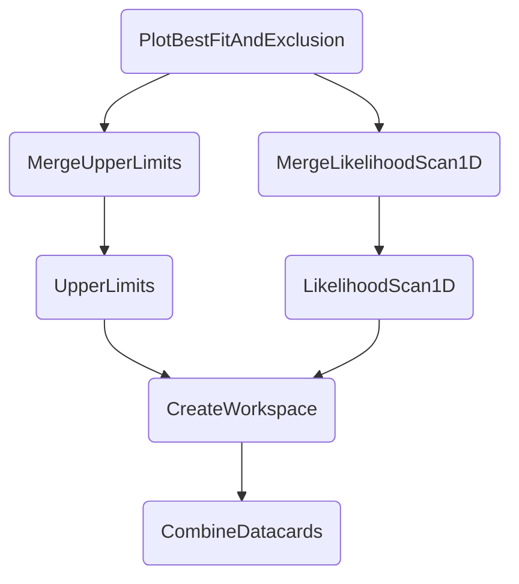

This section documents the usage of various miscellaneous tasks.


## `PlotBestFitAndExclusion`

The task `PlotBestFitAndExclusion` creates a plot showing the best fit values of a POI as well as its excluded region for multiple *configurations* - these can be different versions of datacards, or even channels or analyses as shown in the following plot.


The best fit values are extracted via likelihood profiling done by the [`LikelihoodScan1D`](likelihood1d.md) task. Excluded regions are inferred from the [`UpperLimits`](limits.md) task which scans limits in steps of the same POI as measured on a `--r-poi`, i.e., `r` itself, `r_gghh`or `r_qqhh`. Thus, the depency tree looks like




#### Example command

```shell
law run PlotBestFitAndExclusion \
    --version dev \
    --multi-datacards /afs/cern.ch/user/m/mfackeld/public/datacards/ee_tight/datacard.txt:/afs/cern.ch/user/m/mfackeld/public/datacards/emu_tight/datacard.txt:/afs/cern.ch/user/m/mfackeld/public/datacards/mumu_tight/datacard.txt:/afs/cern.ch/user/m/mfackeld/public/datacards/*/datacard.txt \
    --datacard-names ee,emu,mumu,Combined \
    --r-poi r_gghh --poi kl \
    --campaign FAKE
```


#### Parameters

- `--multi-datacards STRINGS:STRINGS`: Multiple CSV sequences of datacard paths, separated by colons. Mandatory.
- `--datacard-names STRINGS`: Names of datacard sequences for plotting purposes. When set, the number of names must match the number of sequences in `--multi-datacards`. No default.
- `--datacard-order INTS`: Indices of datacard sequences for reordering during plotting. When set, the number of ids must match the number of sequences in `--multi-datacards`. No default.
- `--file-type`: The file type of the produced plot. Should be `pdf` or `png`. Defaults to `pdf`.
- `--r-poi STRING`: The POI for which to obtain the upper limits in order to extract exclusion regions. Should be any of `r`, `r_gghh`, `r_qqhh`. Defaults to `r`.
- `--poi STRING`: The POI to scan. Defaults to `kl`.
- `--poi-range INT,INT`: The range of the POI to scan. Edges are included. Defaults to the minimum and maximum value of the parameter in the physics model.
- `--poi-points INT`: The number of points to scan. Defaults to a value such that the scan step size is one.
