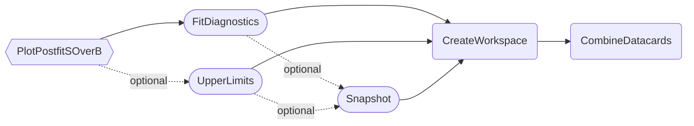
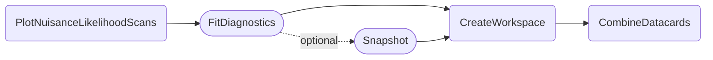

### Combined postfit shapes

The `PlotPostfitSOverB` task reads prefit and postfit shapes from combine's `FitDiagnostics` output, orders their bins by their prefit S-over-B ratio, merges them in a configurable way, and shows the bin contents separately for background-only, the fitted signal and recorded data.

- [Quick example](#quick-example)
- [Dependencies](#dependencies)
- [Parameters](#parameters)
- [Example commands](#example-commands)


#### Quick example

```shell
law run PlotPostfitSOverB \
    --version dev \
    --datacards $DHI_EXAMPLE_CARDS
```

Note that the above command uses `r` as the default POI

Output:


#### Dependencies



Rounded boxes mark [workflows](practices.md#workflows) with the option to run tasks as HTCondor jobs.
Hexagonal boxes mark tasks that can produce [HEPData](https://hepdata-submission.readthedocs.io/en/latest/) compatible yaml files.


#### Parameters

=== "PlotPostfitSOverB"

    --8<-- "content/snippets/plotpostfitsoverb_param_tab.md"

=== "FitDiagnostics"

    --8<-- "content/snippets/fitdiagnostics_param_tab.md"

=== "CreateWorkspace"

    --8<-- "content/snippets/createworkspace_param_tab.md"

=== "CombineDatacards"

    --8<-- "content/snippets/combinedatacards_param_tab.md"


#### Example commands

**1.** Configure custom bin edges and set the minimum y-axis value of the ratio plot:

```shell hl_lines="4-5"
law run PlotPostfitSOverB \
    --version dev \
    --datacards $DHI_EXAMPLE_CARDS \
    --bins "-5,-3,-2,-1.5,-1" \
    --ratio-min 0.5
```

Note the quotes around the bin edges which are required since the first value starts with a dash ("-") which is misinterpreted by the `ArgumentParser` in Python 2.


### Nuisance parameter influence on likelihood

The `PlotNuisanceLikelihoodScans` task reads the outputs of combine's `FitDiagnostics` and illustrates the change of the postfit negative likelihood when changing particular nuisance parameter values.
This is especially useful for debugging nuisances and inspecting their influence on the likelihood during profiling, which should exhibit a smooth effect.

All plots are stored in the same pdf.
There is also the option to draw the curves of multiple parameters in the same plot for better comparison.

- [Quick example](#quick-example_1)
- [Dependencies](#dependencies_1)
- [Parameters](#parameters_1)
- [Example commands](#example-commands_1)


#### Quick example

```shell
law run PlotNuisanceLikelihoodScans \
    --version dev \
    --datacards $DHI_EXAMPLE_CARDS \
    --parameters-per-page 6
```

Note that the above command uses `r` as the default POI

Output:


#### Dependencies



Rounded boxes mark [workflows](practices.md#workflows) with the option to run tasks as HTCondor jobs.


#### Parameters

=== "PlotNuisanceLikelihoodScans"

    --8<-- "content/snippets/plotnuisancelikelihoodscans_param_tab.md"

=== "FitDiagnostics"

    --8<-- "content/snippets/fitdiagnostics_param_tab.md"

=== "CreateWorkspace"

    --8<-- "content/snippets/createworkspace_param_tab.md"

=== "CombineDatacards"

    --8<-- "content/snippets/combinedatacards_param_tab.md"


#### Example commands

**1.** Plot the curves of multiple parameters on the same page, select only parameters related to b-tagging, and choose a log scale:

```shell hl_lines="5-6"
law run PlotNuisanceLikelihoodScans \
    --version dev \
    --datacards $DHI_EXAMPLE_CARDS \
    --parameters-per-page 6 \
    --only-parameters "CMS_btag_*" \
    --y-log
```
