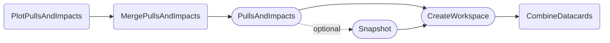

The `PlotPullsAndImpacts` task performs fits and shows both nuisance pulls and their impact on the POI by fixing parameters to their post fit value and extracting the resulting change of the POI.
Nuisance parameters to evaluate are extracted dynamically from the workspace.

- [Quick example](#quick-example)
- [Dependencies](#dependencies)
- [Parameters](#parameters)
- [Example commands](#example-commands)


#### Quick example

```shell
law run PlotPullsAndImpacts \
    --version dev \
    --datacards $DHI_EXAMPLE_CARDS \
    --pois r
```

Output:


!!! info "Failing fits"

    It might happen that some parameter fits fail to converge.
    When this is the case, you will see an error thrown by `MergePullsAndImpacts`, suggesting that you should either remove the outputs of the failed fits and try again with different fit stability options ([fit options in combine](https://cms-analysis.github.io/HiggsAnalysis-CombinedLimit/part3/nonstandard/#fit-options)), or that you can also proceed without the failed parameters.
    Alternatively you can use the `--keep-failures` parameter in order to keep failed fits and continue. In the resulting plot failures are marked as such.


#### Dependencies



Rounded boxes mark [workflows](practices.md#workflows) with the option to run tasks as HTCondor jobs.


#### Parameters

=== "PlotPullsAndImpacts"

    --8<-- "content/snippets/plotpullsandimpacts_param_tab.md"

=== "MergePullsAndImpacts"

    --8<-- "content/snippets/mergepullsandimpacts_param_tab.md"

=== "PullsAndImpacts"

    --8<-- "content/snippets/pullsandimpacts_param_tab.md"

=== "CreateWorkspace"

    --8<-- "content/snippets/createworkspace_param_tab.md"

=== "CombineDatacards"

    --8<-- "content/snippets/combinedatacards_param_tab.md"


#### Example commands

**1.** Execute `PullsAndImpacts` including all MC stats nuisances on HTCondor, and pass `--robustFit 1` to combine:

```shell hl_lines="5-6´7"
law run PlotPullsAndImpacts \
    --version dev \
    --datacards $DHI_EXAMPLE_CARDS \
    --pois r \
    --mc-stats \
    --PullsAndImpacts-custom-args="--robustFit 1" \
    --PullsAndImpacts-workflow htcondor
```
