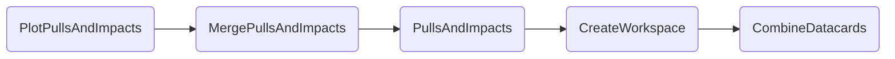

### Pulls and Impacts

The default command to run the entire task chain is

```shell
law run PlotPullsAndImpacts --version dev --datacards $DHI_EXAMPLE_CARDS
```

Output:


#### Dependencies




#### Parameters

=== "PlotPullsAndImpacts"

    --8<-- "content/snippets/plotpullsandimpacts_param_tab.md"

=== "PullsAndImpacts"

    --8<-- "content/snippets/pullsandimpacts_param_tab.md"

=== "CreateWorkspace"

    --8<-- "content/snippets/createworkspace_param_tab.md"

=== "CombineDatacards"

    --8<-- "content/snippets/combinedatacards_param_tab.md"


#### Example commands

1. PlotPullsAndImpacts with `mc-stats` on HTCondor:

```shell hl_lines="4-5"
law run PlotPullsAndImpacts \
    --version dev \
    --datacards $DHI_EXAMPLE_CARDS \
    --mc-stats \
    --PullsAndImpacts-workflow htcondor
```