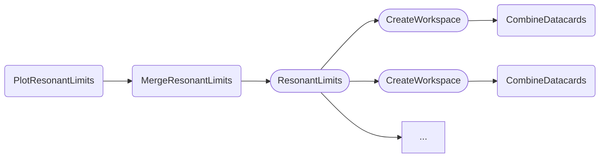
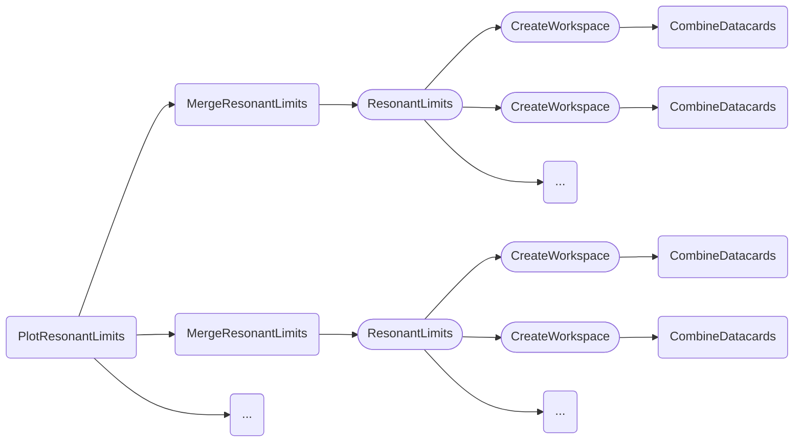

The tasks documented below can be used to produce and visualize the limits corresponding to certain resonance mass hypotheses.
Compared to the [other tasks for obtaining limits](limits.md) which rely on the HH physics model for inter- and extrapolating the effect of variations of the *kappa* values, the resonant limit tasks extract information of the particular hypothesis directly from the name of the used datacard files.
This entails two major differences in the preparation of datacards and the steering of the tasks via parameters.

**Datacards**

The datacards for the various mass hypotheses should be prepared according to the central [naming and datacard conventions](https://gitlab.cern.ch/hh/naming-conventions#hh-signals-for-resonant-results).
In particular, please make sure that

- your ggF signal is normalized to a hypothetical cross section of 1 **pb** (❗️) times the **branching ratio of your channel**, and
- that VBF processes (`qqHH_*`) are dropped except for the SM VBF signal, which should be marked as background by attributing a positive process id to it.

Names of datacard files should have the format

```
datacard_<MASS>.txt
```

where `MASS` is the integer mass value of the resonance.

==If your datacards contribute to the HH combination==, please make sure to use the ==exact same== naming scheme for processes, bins and parameters as the other datacards provided by your channel.

**Task parameters**

==Unlike==, for instance, the [upper limit](limits.md#limit-on-poi-vs-scan-parameter) or [likelihood scan](likelihood.md#single-likelihood-profiles) tasks where a single set of combined cards is used to extract results over a range of scan parameter values, each mass point requires its own datacard.
To allow that cards of different channels can still be combined per point, the usual `--datacards` parameter cannot be used as it targets only a single sequence of cards.

Instead, the tasks below use the `--multi-datacards` parameter that allows to define multiple sequences of files, separated by `:`, to be passed in the format

```
ch1/datacard_A.txt,ch1/datacard_B.txt:ch2/datacard_A.txt,ch2/datacard_B.txt:...
```

In this example, the different sequences `ch1/datacard_A.txt,ch1/datacard_B.txt` and `ch2/datacard_A.txt,ch2/datacard_B.txt` could correspond to different analysis channels.
**Datacards with the same `MASS` (`A` and `B`) across sequences will be combined** by means of the `CombineDatacards` task.
Therefore, a valid example is

```shell
--multi-datacards 'my_cards/datacard_*.txt'
```

for a **single channel**, and

```shell
--multi-datacards 'bbbb/datacard_*.txt:bbgg/datacard_*.txt'
```

for **multiple channels**, where datacards corresponding to the same benchmark will be combined across the channels.
For obvious reasons, the number of files matched by `bbbb/datacard_*.txt` and `bbgg/datacard_*.txt` must be identical.


### Resonant limits

The `PlotResonantLimits` task shows the upper limits on the rate of HH production via gluon-gluon fusion (POI `r_gghh`) obtained for several resonance mass hypotheses.

- [Quick example](#quick-example)
- [Dependencies](#dependencies)
- [Parameters](#parameters)
- [Example commands](#example-commands)


#### Quick example

```shell
law run PlotResonantLimits \
    --version dev \
    --multi-datacards $DHI_EXAMPLE_CARDS_RES \
    --xsec fb
```

As described above, the `--multi-datacards` parameter should be used to identify different sequences of datacards.

Output:


#### Dependencies



Rounded boxes mark [workflows](practices.md#workflows) with the option to run tasks as HTCondor jobs.


#### Parameters

=== "PlotResonantLimits"

    --8<-- "content/snippets/plotresonantlimits_param_tab.md"

=== "MergeResonantLimits"

    --8<-- "content/snippets/mergeresonantlimits_param_tab.md"

=== "ResonantLimits"

    --8<-- "content/snippets/resonantlimits_param_tab.md"

=== "CreateWorkspace"

    --8<-- "content/snippets/createworkspace_param_tab.md"

=== "CombineDatacards"

    --8<-- "content/snippets/combinedatacards_param_tab.md"


#### Example commands

**1.** Execute `ResonantLimits` tasks on HTCondor and apply the branching ratio of the `bbgg` channel to extracted limits:

```shell hl_lines="5-6"
law run PlotResonantLimits \
    --version dev \
    --multi-datacards $DHI_EXAMPLE_CARDS_RES \
    --xsec fb \
    --br bbgg \
    --ResonantLimits-workflow htcondor
```


### Multiple resonant limits

The `PlotMultipleResonantLimits` task shows the upper limits on the rate of HH production via gluon-gluon fusion obtained for several resonance mass hypotheses, but unlike `PlotResonantLimits` described [above](#benchmark-limits), results of datacards are not combined per mass point, but shown separately.

- [Quick example](#quick-example1)
- [Dependencies](#dependencies_1)
- [Parameters](#parameters_1)
- [Example commands](#example-commands_1)


#### Quick example

```shell
law run PlotMultipleResonantLimits \
    --version dev \
    --multi-datacards $$DHI_EXAMPLE_CARDS_RES_1:$DHI_EXAMPLE_CARDS_RES_2 \
    --xsec fb
```

As described above, the `--multi-datacards` parameter should be used to identify different sequences of datacards.

Output:


#### Dependencies



Rounded boxes mark [workflows](practices.md#workflows) with the option to run tasks as HTCondor jobs.


#### Parameters

=== "PlotMultipleResonantLimits"

    --8<-- "content/snippets/plotmultipleresonantlimits_param_tab.md"

=== "MergeResonantLimits"

    --8<-- "content/snippets/mergeresonantlimits_param_tab.md"

=== "ResonantLimits"

    --8<-- "content/snippets/resonantlimits_param_tab.md"

=== "CreateWorkspace"

    --8<-- "content/snippets/createworkspace_param_tab.md"

=== "CombineDatacards"

    --8<-- "content/snippets/combinedatacards_param_tab.md"


#### Example commands

**1.** Execute `ResonantLimits` tasks on HTCondor:

```shell hl_lines="5"
law run PlotMultipleResonantLimits \
    --version dev \
    --multi-datacards $DHI_EXAMPLE_CARDS_RES_1:$DHI_EXAMPLE_CARDS_RES_2 \
    --xsec fb \
    --ResonantLimits-workflow htcondor
```
