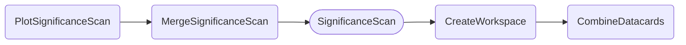
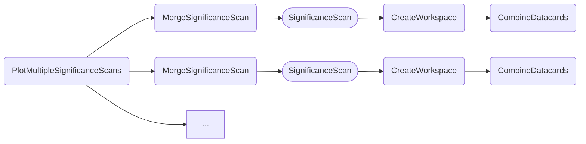

### Significance vs. scan parameter

The `PlotSignificanceScan` task shows the significance over the background-only hypotheses in units of gaussian standard deviations for a single set of datacards.

- [Quick example](#quick-example)
- [Dependencies](#dependencies)
- [Parameters](#parameters)
- [Example commands](#example-commands)


#### Quick example

```shell
law run PlotSignificanceScan \
    --version dev \
    --datacards $DHI_EXAMPLE_CARDS
```

Output:


#### Dependencies



Rounded boxes mark [workflows](practices.md#workflows) with the option to run tasks as HTCondor jobs.


#### Parameters

=== "PlotSignificanceScan"

    --8<-- "content/snippets/plotsignificancescan_param_tab.md"

=== "MergeSignificanceScan"

    --8<-- "content/snippets/mergesignificancescan_param_tab.md"

=== "SignificanceScan"

    --8<-- "content/snippets/significancescan_param_tab.md"

=== "CreateWorkspace"

    --8<-- "content/snippets/createworkspace_param_tab.md"

=== "CombineDatacards"

    --8<-- "content/snippets/combinedatacards_param_tab.md"


#### Example commands

**1.** Run the for POI `r_qqhh`, scanning over `C2V` in the range `[-10,10]` with two points per integer step, including edges.

```shell hl_lines="4-5"
law run PlotSignificanceScan \
    --version dev \
    --datacards $DHI_EXAMPLE_CARDS
    --pois r_qqhh \
    --scan-parameter C2V,-10,10,41
```

**2.** Executing `SignificanceScan` tasks on htcondor, with one job handling two tasks sequentially:

```shell hl_lines="4-5"
law run PlotSignificanceScan \
    --version dev \
    --datacards $DHI_EXAMPLE_CARDS
    --SignificanceScan-workflow htcondor \
    --SignificanceScan-tasks-per-job 2
```


### Multiple significance scans vs. scan parameter

The `PlotMultipleSignificanceScans` task creates a plot showing significance scans of multiple *configurations* - these can be different versions of datacards, or even channels or analyses.
Instead of a parameter `--datacards`, this task introduces a `--multi-datacards` parameter.
It takes several CSV sequences of datacard paths, separated by a colon, e.g. `--multi-datacards card_ee_1.txt,card_ee_2.txt:card_mumu_1.txt,card_mumu_2.txt`.

- [Quick example](#quick-example_1)
- [Dependencies](#dependencies_1)
- [Parameters](#parameters_1)
- [Example commands](#example-commands_1)


#### Quick example

```shell
law run PlotMultipleSignificanceScans \
    --version dev \
    --multi-datacards $DHI_EXAMPLE_CARDS:$DHI_EXAMPLE_CARDS_GGF:$DHI_EXAMPLE_CARDS_VBF \
    --scan-parameter kl,-2,6
```

Output:


#### Dependencies



Rounded boxes mark [workflows](practices.md#workflows) with the option to run tasks as HTCondor jobs.


#### Parameters

=== "PlotMultipleSignificanceScans"

    --8<-- "content/snippets/plotmultiplesignificancescans_param_tab.md"

=== "MergeSignificanceScan"

    --8<-- "content/snippets/mergesignificancescan_param_tab.md"

=== "SignificanceScan"

    --8<-- "content/snippets/significancescan_param_tab.md"

=== "CreateWorkspace"

    --8<-- "content/snippets/createworkspace_param_tab.md"

=== "CombineDatacards"

    --8<-- "content/snippets/combinedatacards_param_tab.md"


#### Example commands

**1.** Executing `SignificanceScan` tasks on htcondor, with one job handling two tasks sequentially, and updating the labels:

```shell hl_lines="3-5"
law run PlotMultipleSignificanceScans \
    --multi-datacards $DHI_EXAMPLE_CARDS:$DHI_EXAMPLE_CARDS_GGF:$DHI_EXAMPLE_CARDS_VBF \
    --datacard-names All,ggF,VBF \
    --SignificanceScan-workflow htcondor \
    --SignificanceScan-tasks-per-job 2
```
