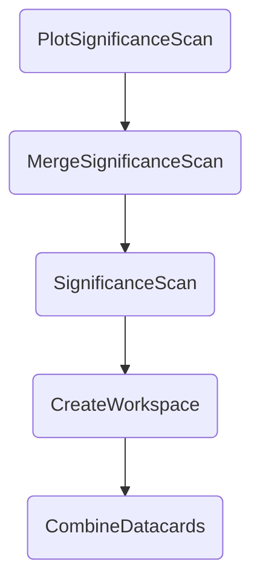

This section documents the usage of the tasks `SignificanceScan`, `MergeSignificanceScan` and `PlotSignificanceScan`.


## Task structure

The default command to run the entire task chain up to `PlotSignificanceScan` is

```shell hl_lines="1"
law run PlotSignificanceScan --version dev --datacards $DHI_EXAMPLE_CARDS
```

and, as usual, you can check the task structure and current output status beforehand by appending `--print-status TASK_DEPTH` to the command. Let's choose -1 to see the structure down to the first task (`CombineDatacards`):

```shell hl_lines="1"
law run PlotPullsAndImpacts --version dev --datacards $DHI_EXAMPLE_CARDS --print-status 4

print task status with max_depth -1 and target_depth 0

> PlotSignificanceScan(version=dev, hh_model=HHModelPinv:HHdefault, datacards=hash:0101a84036, mass=125.0, dc_prefix=, poi=kl, poi_range=-30.0,30.0, poi_points=61, r_poi=r, file_type=pdf)
|   LocalFileTarget(path=$DHI_STORE/PlotSignificanceScan/model_HHModelPinv_HHdefault/datacards_d481e43b9e/m125.0/r__kl/dev/significances__r__kl_n61_-30.0_30.0.pdf)
|     absent
|
|  > MergeSignificanceScan(version=dev, hh_model=HHModelPinv:HHdefault, datacards=hash:0101a84036, mass=125.0, dc_prefix=, poi=kl, poi_range=-30.0,30.0, poi_points=61, r_poi=r)
|  |   LocalFileTarget(path=$DHI_STORE/MergeSignificanceScan/model_HHModelPinv_HHdefault/datacards_d481e43b9e/m125.0/r__kl/dev/significance__r__kl_n61_-30.0_30.0.npz)
|  |     absent
|  |
|  |  > SignificanceScan(branch=-1, start_branch=0, end_branch=61, branches=, version=dev, custom_args=, hh_model=HHModelPinv:HHdefault, datacards=hash:0101a84036, mass=125.0, dc_prefix=, poi=kl, poi_range=-30.0,30.0, poi_points=61, r_poi=r, workflow=local)
|  |  |   collection: SiblingFileCollection(len=61, threshold=61.0, dir=$DHI_STORE/SignificanceScan/model_HHModelPinv_HHdefault/datacards_d481e43b9e/m125.0/r__kl/dev)
|  |  |     absent (0/61)
|  |  |
|  |  |  > CreateWorkspace(version=dev, custom_args=, hh_model=HHModelPinv:HHdefault, datacards=hash:0101a84036, mass=125.0, dc_prefix=)
|  |  |  |   LocalFileTarget(path=$DHI_STORE/CreateWorkspace/model_HHModelPinv_HHdefault/datacards_d481e43b9e/m125.0/dev/workspace.root)
|  |  |  |     absent
|  |  |  |
|  |  |  |  > CombineDatacards(version=dev, custom_args=, hh_model=HHModelPinv:HHdefault, datacards=hash:0101a84036, mass=125.0, dc_prefix=)
|  |  |  |  |   LocalFileTarget(path=$DHI_STORE/CombineDatacards/model_HHModelPinv_HHdefault/datacards_d481e43b9e/m125.0/dev/datacard.txt)
|  |  |  |  |     absent
```

The overall dependency structure is




## `SignificanceScan`

`SignificanceScan` is a so-called ==worfklow==, i.e., a task that splits its workfload into multiple ==branches== that can be run in parallel - either locally or by submitting them to a batch system.
Here, `SignificanceScan` defines 61 branches with each branch calculating the significance for one value of the (**non-`r`**) `--poi`, which defaults to `kl`.
By definition, the output of a workflow is the ==collection== of all outputs of its branches, which is reflected in the status output above.

If you were to run the `SignificanceScan` task directly, the actual branch to run can be defined by adding `--branch N` to the command.
Passing -1 would trigger the entire workflow to be run (which is done locally by default) whereas positive numbers select a particular branch.
To get more insight into this mechanism, we can check the detailed output by passing a target depth (here 1) as a second value to `--print-status`.
Note that the first line of the output now says `... and target_depth 1`.

```shell hl_lines="1"
law run SignificanceScan --version dev --datacards $DHI_EXAMPLE_CARDS --print-status 0,1

print task status with max_depth 0 and target_depth 1

> SignificanceScan(branch=-1, start_branch=0, end_branch=61, branches=, version=dev, custom_args=, hh_model=HHModelPinv:HHdefault, datacards=hash:0101a84036, mass=125.0, dc_prefix=, poi=kl, poi_range=-30.0,30.0, poi_points=61, r_poi=r, workflow=local)
|   collection: SiblingFileCollection(len=61, threshold=61.0, dir=$DHI_STORE/SignificanceScan/model_HHModelPinv_HHdefault/datacards_d481e43b9e/m125.0/r__kl/dev)
|     absent (0/61)
|     0: absent (LocalFileTarget(path=$DHI_STORE/SignificanceScan/model_HHModelPinv_HHdefault/datacards_d481e43b9e/m125.0/r__kl/dev/significance__r__kl_-30.0.root))
|     1: absent (LocalFileTarget(path=$DHI_STORE/SignificanceScan/model_HHModelPinv_HHdefault/datacards_d481e43b9e/m125.0/r__kl/dev/significance__r__kl_-29.0.root))
|     2: absent (LocalFileTarget(path=$DHI_STORE/SignificanceScan/model_HHModelPinv_HHdefault/datacards_d481e43b9e/m125.0/r__kl/dev/significance__r__kl_-28.0.root))
|     3: absent (LocalFileTarget(path=$DHI_STORE/SignificanceScan/
|
|     ...
|
|     60: absent (LocalFileTarget(path=/eos/user/m/mrieger/dhi/store/SignificanceScan/model_HHModelPinv_HHdefault/datacards_d481e43b9e/m125.0/r__kl/dev/significance__r__kl_30.0.root))
```

To get the significance only for a particular value of `kl`, one could either lookup the proper branch number in the above output.
However, this is tedious and only recommended in certain cases.
Instead, you can just manipulate the range of the `kl` that is scanned to contain only a single value and set the `--branch` parameter to `0`, i.e., the only existing branch:

```shell hl_lines="1"
law run SignificanceScan --version dev --datacards $DHI_EXAMPLE_CARDS --poi-range 1,1 --branch 0 --print-status 0

print task status with max_depth 0 and target_depth 0

> SignificanceScan(branch=0, version=dev, custom_args=, hh_model=HHModelPinv:HHdefault, datacards=hash:0101a84036, mass=125.0, dc_prefix=, poi=kl, poi_range=1.0,1.0, poi_points=1, r_poi=r)
|   LocalFileTarget(path=$DHI_STORE/SignificanceScan/model_HHModelPinv_HHdefault/datacards_d481e43b9e/m125.0/r__kl/dev/significance__r__kl_1.0.root)
|     absent
```

**Parameters**

- `--mass FLOAT`: The hypothetical mass of the underlying resonance. Defaults to `125.0`.
- `--hh-model MODULE`: The name of the HH model relative to `dhi.models` in the format `module:model_name`. Defaults to `hh:HHdefault`.
- `--version STRING`: Task version. Mandatory.
- `--datacards STRINGS`: Comma-separated paths or patterns to datacards to use. Accepts bin statements such as `emu=datacard.txt,...`. Mandatory.
- `--r-poi STRING`: The POI to obtain the significance for. Should be any of `r`, `r_gghh`, `r_qqhh`. Defaults to `r`.
- `--poi STRING`: The POI to scan. Defaults to `kl`.
- `--poi-range INT,INT`: The range of the POI to scan. Edges are included. Defaults to the minimum and maximum value of the parameter in the physics model.
- `--poi-points INT`: The number of points to scan. Defaults to a value such that the scan step size is one.
- `--workers INT`: The number of cores to use for local processing. Defaults to `1`.
- `--print-status INT[,INT]`: When set, the first first value defines the depth of tasks whose status is printed. The second value configures the depth of nested targets and defaults to `0`. No task is actually processed.
- `--print-command INT`: When set, tasks which just execute a command via the shell print their command in a structured fashion. No task is actually processed.
- `--remove-output INT[,{a,i,d}]`: When set, task outputs are removed with a task depth corresponding to the first value. As this can be a dangerous step, the user is asked how targets should be removed, which can be either interactively (`i`), as a dry-run (`d`), or all without asking further questions ('a'). To avoid seeing this prompt, the mode can be directly set through the second value.


### Running on HTCondor

When working with large workspaces, each particular branch can take quite a while to process.
To run all tasks as jobs over HTCondor, just add `--workflow htcondor` to the command.
To control the *workflow type* when executing an upstream task, use full parameter location `--SignificanceScan-workflow htcondor` instead.

When configured to run on HTCondor, a few additional **parameters** are enabled.

- `--poll-interval INT/STRING`: The time between status polls in minutes. Allows verbose duration strings such as e.g. `45s`. Defaults to `1min`.
- `--retries INT`: The number of retries per job. Defaults to `3`.
- `--max-runtime INT/STRING`: The maximum job runtime in hours. Allows verbose duration strings such as e.g. `45mins`. Defaults to `2h`.
- `--parallel-jobs`: The maximum number of parallel jobs being processed. Defaults to `-1` which means that all jobs are run in parallel.
- `--tasks-per-job`: The number of tasks that each job is processing. Defaults to `1`, meaning that each job runs exactly one task.


## `MergeSignificanceScan`

The `MergeSignificanceScan` collects the results of all branches of `SignificanceScan`, i.e., it requires the full workflow as can be seen in the first status output above (`SignificanceScan(branch=-1, ...)`).
It produces a single NumPy file containing all significance values and corresponding POI values in a record array.

**Parameters**

Same as [`SignificanceScan`](#significancescan).


## `PlotSignificanceScan`

The `PlotSignificanceScan` task reads the produced array of the `MergeSignificanceScan` task and creates a plot such as


**Parameters**

Same as [`SignificanceScan`](#significancescan).
