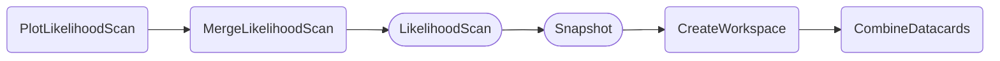

The `Snapshot` task is essentially performing a `MultiDimFit` and saves a copy of the initial workspace with all parameters set to their best fit values.
This updated workspace can be used in all subsequent `combine` commands just like the normal workspace, with the benefit that parameters are already at sensible values before the fit which can lead to faster and potentially more stable convergence.
See the [combine documentation](http://cms-analysis.github.io/HiggsAnalysis-CombinedLimit/part3/runningthetool/#loading-snapshots) for more info on snapshots.

Almost all tasks within the inference tools are able to use a workspace snapshot instead of the normal workspace by adding ==`--use-snapshot`== to the `law run ...` command to run.
By doing so, the requirement structure is slightly changed in order to first run the snapshot for the selected datacards, HH physics model, parameter options, blinded / unblinded flags, etc.

As an example, the workflow triggered by `PlotLikelihoodScan` with the additional `--use-snapshot` option will look like this:



Note the additional `Snapshot` task between `Likelihoodscan` and `CreateWorkspace`.
In any other regard, the `Snapshot` behaves like the `LikelihoodScan` task, i.e., it supports the same options and it is able to submit jobs to HTCondor (as indicated by the round boxes).

- [Quick example](#quick-example)
- [Dependencies](#dependencies)
- [Parameters](#parameters)
- [Example commands](#example-commands)


#### Quick example

```shell
law run Snapshot \
    --version dev \
    --datacards $DHI_EXAMPLE_CARDS \
    --pois r
```

#### Dependencies


Rounded boxes mark [workflows](practices.md#workflows) with the option to run tasks as HTCondor jobs.


#### Parameters

=== "LikelihoodScan"

    --8<-- "content/snippets/snapshot_param_tab.md"

=== "CreateWorkspace"

    --8<-- "content/snippets/createworkspace_param_tab.md"

=== "CombineDatacards"

    --8<-- "content/snippets/combinedatacards_param_tab.md"


#### Example commands

**1.** Blinded snapshot on POI `kl` with `kt` set to 1.5.

```shell hl_lines="4-5"
law run Snapshot \
    --version dev \
    --datacards $DHI_EXAMPLE_CARDS \
    --pois kl \
    --parameter-values kt=1.5
```


**2.** Same as example command 1, but execute the snapshot task on HTCondor and run unblinded.

```shell hl_lines="6-7"
law run Snapshot \
    --version dev \
    --datacards $DHI_EXAMPLE_CARDS \
    --pois kl \
    --parameter-values kt=1.5 \
    --workflow htcondor \
    --unblinded
```
